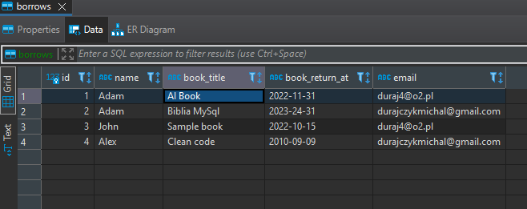
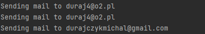
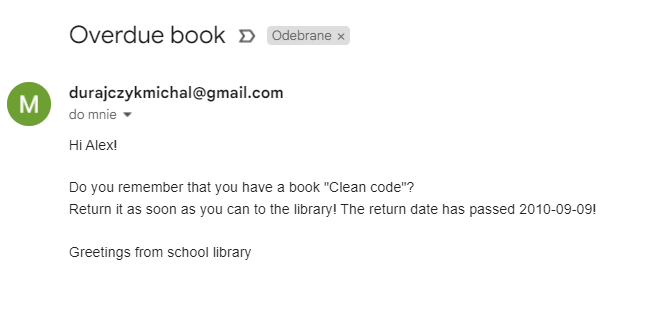

# Book reminder

The application connects to the database, checks all the people and if the date of returning the book has passed, sends a reminder email.

## Technologies
* Python 3.10+
* SQLite

## Libraries needed to install
* dotenv `pip install python-dotenv`

## Setup
* Clone this repo `git clone https://github.com/mduraj0/ProjectSendMails.git` and install the necessary libraries
* Complete your data in .env, 
If you use gmail configure your email,  [Authorizing Your App with Gmail](https://developers.google.com/gmail/api/auth/about-auth#:~:text=authorizing%20your%20app%20with%20gmail).
* run in python `python main.py`

## Screenshots

 

